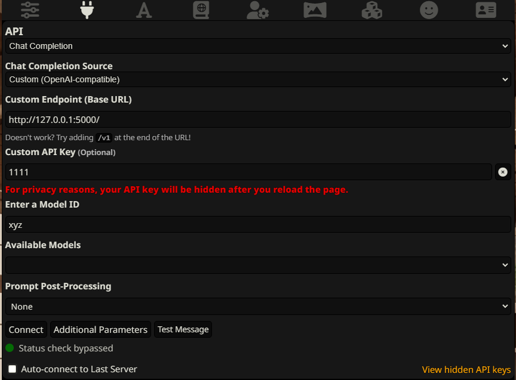
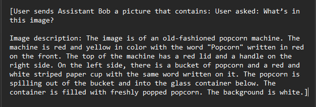
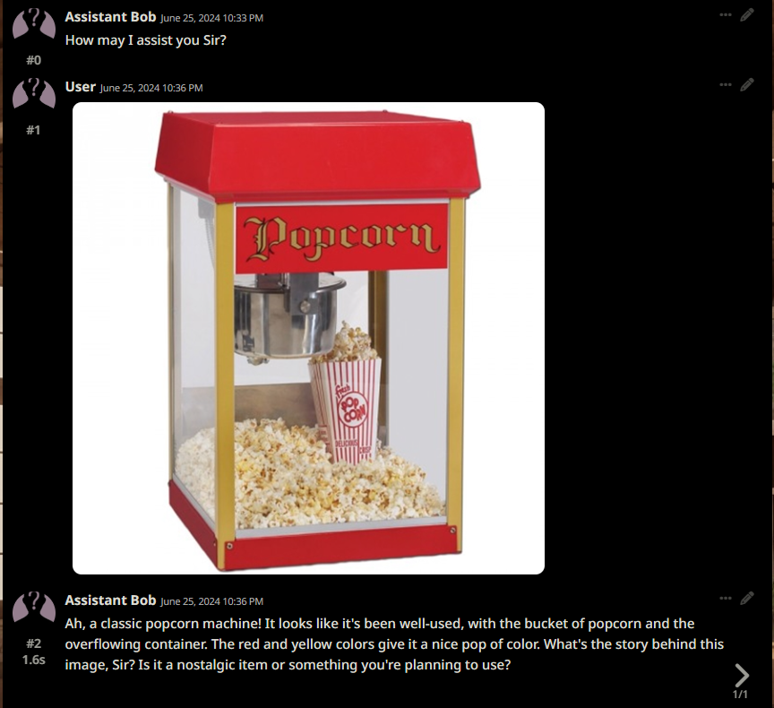

# FloCap - Florence-2 Captioning API
FloCap is an OpenAI compatible API server that utilizes the Florence-2 large language model for image captioning. This application provides an API endpoint that accepts image inputs and returns detailed captions or analyses based on the Florence-2 model's capabilities.

FloCap was primarily created for use with SillyTavern but should work with any frontend/client capable of sending images to an OpenAI compatible API.

## The Florence-2 Model
Florence-2 is an advanced vision foundation model, from Microsoft, that uses a prompt-based approach to handle a wide range of vision and vision-language tasks. Florence-2 can interpret simple text prompts to perform tasks like captioning, object detection, and segmentation. It leverages our FLD-5B dataset, containing 5.4 billion annotations across 126 million images, to master multi-task learning. The model's sequence-to-sequence architecture enables it to excel in both zero-shot and fine-tuned settings, proving to be a competitive vision foundation model.

### Model usage notes
- FloCap is currently only using the MORE_DETAILED_CAPTION mode of the model and does not require or use any prompt.

## Recommendations
We recommend running this application using CPU instead of GPU for the following reasons:

### Resource Usage:

**CPU**: Uses approximately 7GB of RAM
**GPU**: Uses about 7GB of RAM plus an additional 6.5GB of VRAM


Python Version Requirements:

**CPU**: Requires Python 3.10 or above
**GPU**: Requires Python 3.10 specifically


Performance Considerations:

While CPU inference is approximately 3 times slower than GPU, the actual time difference is typically not significant enough to be an issue for most use cases.


Given these factors, using the CPU version offers more flexibility in terms of Python version compatibility and reduces overall resource consumption, making it a more accessible option for a wider range of users and systems.

## Installation

### Windows

1. 
- **CPU** Ensure you have Python 3.10 or later installed on your system.

or

- **GPU** Ensure you have Python 3.10 installed or will have a virtual environment with Python 3.10 installed.

2. Clone this repository:
   ```
   git clone https://github.com/wegwerfen/flocap.git
   cd flocap
   ```

3. Create a virtual environment:
   ```
   python -m venv venv
   venv\Scripts\activate
   ```

4. 
- **CPU** Install the required packages:
   ```
   pip install -r requirements.txt
   ```
or
- **GPU** Install the required packages:
   ```
   pip install torch torchvision torchaudio --index-url https://download.pytorch.org/whl/cu118
   pip install -r requirements.txt

5. Run the application:
   ```
   python flocap.py
   ```

### Linux/WSL

1. 
- **CPU** Ensure you have Python 3.10 or later installed on your system.

or

- **GPU** Ensure you have Python 3.10 installed or will have a virtual environment with Python 3.10 installed.

2. Clone this repository:
   ```
   git clone https://github.com/wegwerfen/flocap.git
   cd flocap
   ```

3. Create a virtual environment:
   ```
   python -m venv venv
   venv\Scripts\activate
   ```

4. 
- **CPU** Install the required packages:
   ```
   pip install -r requirements.txt
   ```
or
- **GPU** Install the required packages:
   ```
   pip install torch torchvision torchaudio --index-url https://download.pytorch.org/whl/cu118
   pip install -r requirements.txt

5. Run the application:
   ```
   python flocap.py
   ```

### Docker

Docker installation instructions are coming soon. This section will be updated when Docker support is implemented.

## SillyTavern Usage

1. In **Extensions** (the 3 blocks icon) check for **Image Captioning**. If it is not there click on **Manage Extensions** at the top right and then check **Image Captioning**, then close.


2. Open the **Image Captioning** settings (click down arrow to the right).

3. **Source** = Multimodal (OpenAI / Anthropic / llama / Google).  

   **API** = Custom (OpenAI Compatible). 

   **Model** = Leave at Currently selected.

   **Caption Prompt** = Doesn't matter, it isn't used.


4. In **API Connections** (Plug icon):

   **API** = Chat Completion.

   **Chat Completion Source** = Custom (OpenAI-compatible)

   **Custom Endpoint (Base URL)** = http://localhost:5000/  or http://127.0.0.1:5000/

   **Custom API Key** = enter anything.

   **Enter Model ID** = enter anything.

   If you have the application running you can click connect or, come back after it is running and click connect.
   Switch back to your original API configuration leaving the ones we just set unchanged. SillyTavern will still use the ones we set for image captioning.

   

5. In a chat click on the **Extras Extensions** icon (the wand) in the bottem left. Select **Generate Caption**. Select image. If you have it set to approve/modify the caption you can click on Send. Character will not respond to the image until you click the arrow either with or without a prompt from you.





## Other Client Usage

After starting the application, you can send POST requests to `http://localhost:5000/chat/completions` with JSON payloads containing image data and prompts. The API will respond with captions or analyses generated by the Florence-2 model.

Detailed API documentation and example requests will be provided in a separate document.

## Contributing

Contributions to the Florence 2 API App are welcome. Please feel free to submit pull requests or create issues for bugs and feature requests.

## License

This application is licensed under the MIT license.